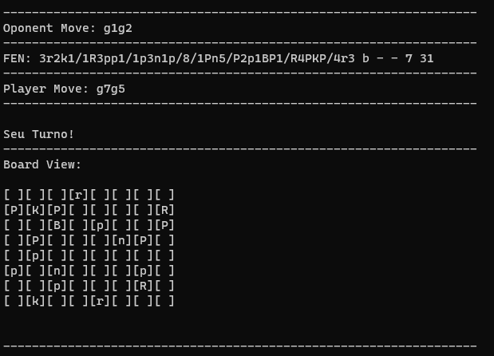
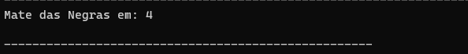

# ChessAI - Bot Chess Engine

ChessAI é um projeto pessoal com a ideia de implementar um robo para jogar xadrez no site Chess.com

---

### Sobre
Por se tratar de um webdriver, ao executar a chamada `node chess.js` o chromedriver será iniciado e o robo automaticamente entrará em partidas online como convidado ou "Guest". É possível acompanhar no terminal a execução do programa, contendo informações sobre a situação atual da partida:

É possível ver a jogada feita pelo Oponente, a jogada que será feita pelo Player a FEN do estado atual do tabuleiro e também uma representação visual simples do tabuleiro e a posição de cada peça no momento.
A todo instante o Stockfish verifica por uma possibilidade futura de Xeque-Mate e caso o encontre irá informá-lo no terminal em quantas jogadas isso ocorrerá:

As promoções de peões estão configuradas para promover para uma Dama ou Rainha sempre que ocorrerem.
Ao final de cada partida, o Bot irá buscar a próxima partida automaticamente.

---

### Informações Importantes
A ideia do ChessAI foi pensada para utilizar a automação do navegador com webdriver através de um script javascript utilizando o módulo SeleniumJS.
Por se tratar de uma interação com webdriver é `OBRIGATÓRIO` a instalação do mesmo, tendo sido, o projeto, originalmente feito com o chromedriver.

Você pode encontrar para download todas as versões do chromedriver no seguinte link: https://chromedriver.chromium.org/downloads

**Lembrando que existem duas opções de instalação para o webdriver**:
  1. Salvar o binário, `chromedriver.exe` em uma pasta de sua escolha e adicionar essa pasta ao `PATH` do seu sistema.
  2. Você pode adicionar o binário `chromedriver.exe` diretamente dentro do diretório `ChessAI/Bot` do repositório.
  
---

### Instalação

- `
pip install stockfish
                         `
Este módulo stockfish basicamente será a interface que fará a comunicação entre o script chess.js e a engine do Stockfish 14.1
- `npm install`
Este comando será necessário para instalar as dependências do projeto e para garantir o funcionamente correto de todas as funcionalidades.

---

### Considerações

O Objetivo por trás desse projeto é inteiramente educacional, com o foco no aprendizado de algumas tecnologias e também para realizar um desejo que sempre tive de cumprir esse projeto. Sinta-se livre para utilizá-lo da forma que desejar, peço que por gentileza, não utilize este projeto para fins que prejudiquem a qualquer pessoa, ou para ganho pessoal. **Mantenha a esportividade sempre e divirta-se :)**

Estarei a dispocição para qualquer dúvida ou problema.

Naissinger.
